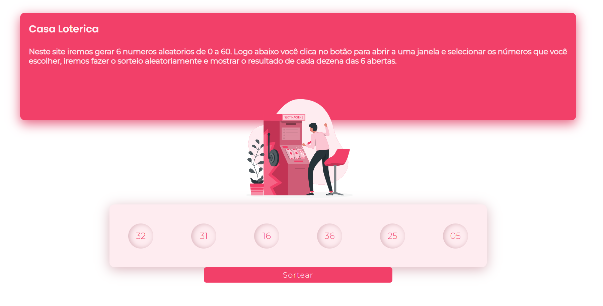
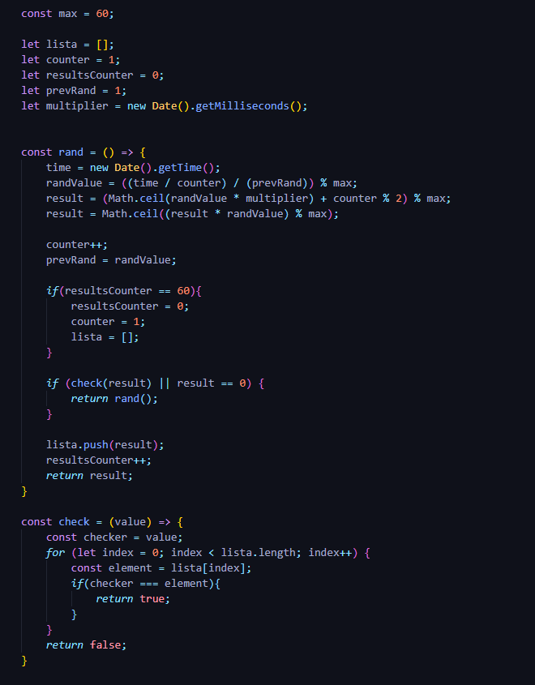

# Casa Lotérica 🤑
Neste site iremos gerar uma sequência de seis números aleatórios de 01 a 60 toda vez que o usuário clicar no botão Sortear.

 

Acesse o Site por aqui: 🤳

   

## Screenshots

### Tela pelo computador: 💻

   

### Tela pelo celular: 📱

   

## Como funciona? 🤔

### Lógica 
Para a lógica, a equipe utilizou de uma técnica muito interessante para geração de números mais randômicos possíveis, sabendo que, um computador não consegue gerar números realmente aleatórios, porém, com esse código, é possível ter a sensação de uma aleatoriedade nos números.     Assim, foi utilizado o tempo local do computador como base da geração de números, e para imitar uma randomização, esse número gerado será divido por um contador que é incrementado a cada chamada da função e também o resultado dessa divisão será dividido pelo número aleatório que foi gerado anteriormente, veja que, para a primeira geração aleatória, o número anterior é definido como 1, e só após o primeiro ciclo de código esse número começa a ser trocado pelos números que serão gerados e no fim pegamos o resto da divisão desse resultado por 60 para termos somente números até 60. Depois, a equipe resolveu adicionar mais duas rodadas de cálculo para deixar o resultado mais randômico possível,
sendo o segundo cálculo uma multiplicação do resultado anterior pelo tempo atual em milissegundos somado com o resto da divisão do contador por 2 e de novo pegando o resultado de tudo isso e dividindo por 60, assim obtendo um resto que vai até 60. E para finalizar, calculamos o arredondamento desse último resultado e multiplicamos pelo resultado do primeiro cálculo.

### Código 

   

#### Explicação do código:
Seguindo o que já foi dito na lógica, temos acima a tradução do texto para código em JavaScript, porém com alguns detalhes a mais, para evitar repetições, precisamos utilizar de uma técnica chamada Recursividade, com ela, podemos retornar a função rand() dentro dela mesma sob uma condição, e essa condição se liga a função Check(), na função check nós pegamos o valor final gerado pelo código e verificamos se ele se repete dentro de uma lista com os valores gerados anteriormente, se houver repetições retornasse a função rand de novo para a geração de um novo valor, se não, o valor retornado é aquele mesmo que já foi gerado. A lista utilizada vai se enchendo até que todos os valores de 01 a 60 sejam incluídos nela, após isso, ela é zerada para que tudo possa começar da forma mais aleatória novamente. Logo, é possível observar que dentro de 10 ciclos de clique no Sortear, não haverá a repetição de nenhum número, tornando o programa no seu ápice de anti repetições tanto dentro da sequência de seis dezenas, quanto em sequencias de cliques.
